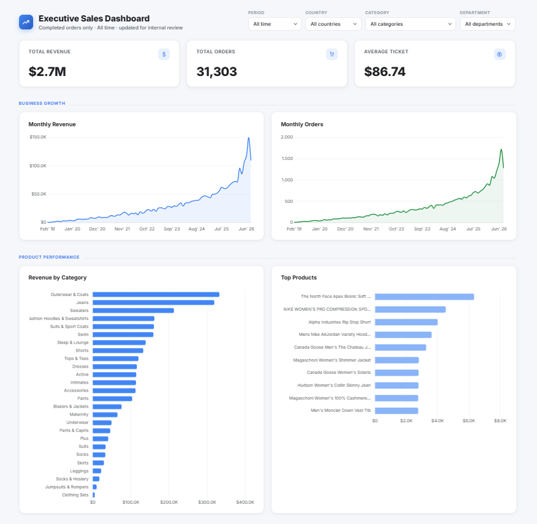

# E-commerce Sales Analytics

> An end-to-end data analytics project transforming e-commerce transactional data into actionable business insights through data profiling, SQL analysis, Google BigQuery, and an executive sales dashboard.

---

## Dashboard Preview



> **Executive Sales Dashboard** — a consolidated view of revenue, order volume, product performance, and geographic market performance.

**[Open the Interactive Dashboard](https://cassio-bressan.github.io/ecommerce-sales-analytics/)**

---

## Project Overview

This project presents an end-to-end **e-commerce sales analytics solution** developed to transform transactional data into reliable business information and decision-support insights.

The project covers the complete analytical workflow, from **data profiling and quality validation** to the creation of an analytical layer in **Google BigQuery**, SQL-based business analysis, and the development of an executive dashboard.

Rather than focusing only on visualization, the project was structured around clearly defined **business questions** related to revenue growth, product performance, and market performance.

The final result is an analytical workflow that connects data quality, SQL analysis, and business-oriented visualization into a single portfolio project.

---

## Business Problem

E-commerce operations generate large volumes of transactional data, but raw transaction records alone do not provide an efficient view of overall business performance.

Decision-makers need to understand how revenue is evolving, which products and categories contribute most to sales, and how performance varies across different geographic markets.

The challenge addressed by this project was therefore to transform transactional e-commerce data into a **reliable analytical layer and an executive-level view of sales performance**.

### Key Business Needs

* Monitor revenue performance over time
* Track completed order volume
* Evaluate average ticket
* Identify the categories generating the most revenue
* Identify the products generating the most revenue
* Compare revenue performance across countries
* Analyze average ticket across different markets
* Provide a consolidated dashboard for executive-level analysis

---

## Project Objectives

The project was developed with the following objectives:

* Build a structured analytical layer from e-commerce transactional data
* Perform data profiling before business analysis
* Validate data quality and data consistency
* Develop SQL-based business metrics using Google BigQuery
* Analyze sales performance across time, products, and geographic markets
* Translate analytical results into an executive-oriented dashboard
* Organize the complete analytical process into a reproducible portfolio project

---

# Dataset

The project is based on the The Look E-commerce public dataset, provided through Google BigQuery.

The dataset simulates an e-commerce business and contains information about customers, orders, products, order items, and related transactional data.

The data was organized into an analytical view named `vw_sales`, stored in the `analytics` dataset within Google BigQuery.

### Dataset Overview

| Attribute                   | Description                              |
| --------------------------- | ---------------------------------------- |
| Platform                    | Google BigQuery                          |
| Dataset                     | `analytics`                              |
| Analytical View             | `vw_sales`                               |
| Main Measure                | `sale_price`                             |
| Main Transaction Identifier | `order_id`                               |
| Product Identifier          | `product_id`                             |
| Customer Identifier         | `user_id`                                |
| Order Status                | `status`                                 |
| Time Dimension              | `year_month`                             |
| Product Dimension           | `category`, `product_name`, `department` |
| Geographic Dimension        | `country`, `state`, `city`               |

The analytical view provides the fields required to perform the business analysis and build the dashboard.

### Data Coverage

The dataset covers multiple years of e-commerce activity and includes transactions across multiple countries and product categories.

For the business analysis presented in the dashboard, **completed orders (`status = 'Complete'`)** are used as the basis for revenue, order, and average-ticket calculations.

---

# Analytics Workflow

The project follows a structured analytical workflow:

```text
E-commerce Transactional Data
            │
            ▼
     Data Profiling
            │
            ▼
   Data Quality Validation
            │
            ▼
      Analytical Layer
        `vw_sales`
            │
            ▼
       SQL Analysis
            │
            ▼
   Business Metrics
            │
            ▼
   Executive Dashboard
```

### 1. Data Profiling

The dataset was inspected to understand its structure, available fields, data types, temporal coverage, and potential data quality issues.

The profiling stage provided the foundation for subsequent validation and analysis.

### 2. Data Quality Validation

Data quality checks were performed before using the dataset for business analysis.

The validation process included checks related to:

* Record counts
* Missing values
* Duplicate records
* Numerical fields
* Temporal coverage
* Referential integrity
* Consistency between related datasets

### 3. Analytical Layer

The analytical view `vw_sales` was created to provide a structured and analysis-ready representation of the e-commerce data.

This layer consolidates the fields required for the business questions and dashboard metrics.

### 4. SQL Business Analysis

SQL queries were developed in BigQuery to calculate the metrics used throughout the project.

The analysis focuses exclusively on the defined business questions and does not introduce unrelated indicators.

### 5. Dashboard Development

The analytical results were transformed into an executive dashboard designed to provide a concise view of sales performance.

---

# Business Questions

The dashboard was designed around four analytical areas.

## Executive Overview

The dashboard provides three high-level KPIs:

### Total Revenue

What is the total revenue generated from completed orders?

### Total Orders

How many distinct completed orders were generated?

### Average Ticket

What is the average revenue generated per completed order?

---

## Business Growth

### Monthly Revenue Trend

How does revenue evolve over time?

### Monthly Orders Trend

How does completed order volume evolve over time?

These analyses provide a high-level view of the evolution of sales performance.

---

## Product Performance

### Revenue by Category

Which product categories generate the highest revenue?

### Top Products by Revenue

Which individual products generate the highest revenue?

These analyses help identify the products and categories that contribute most to overall sales performance.

---

## Market Performance

### Revenue by Country

Which countries generate the highest revenue?

### Average Ticket by Country

How does average order value vary across different countries?

These analyses provide a geographic perspective on sales performance.

---

# Business Metrics

The dashboard metrics were defined using the following business rules.

### Total Revenue

```sql
SUM(sale_price)
```

filtered to:

```sql
status = 'Complete'
```

### Total Orders

```sql
COUNT(DISTINCT order_id)
```

filtered to:

```sql
status = 'Complete'
```

### Average Ticket

```sql
SUM(sale_price) / COUNT(DISTINCT order_id)
```

filtered to:

```sql
status = 'Complete'
```

### Revenue by Category

```sql
SUM(sale_price)
```

grouped by:

```sql
category
```

and filtered to completed orders.

### Top Products by Revenue

```sql
SUM(sale_price)
```

grouped by:

```sql
product_name
```

with the analysis restricted to the top 10 products by revenue.

### Revenue by Country

```sql
SUM(sale_price)
```

grouped by:

```sql
country
```

and filtered to completed orders.

### Average Ticket by Country

```sql
SUM(sale_price) / COUNT(DISTINCT order_id)
```

grouped by:

```sql
country
```

and filtered to completed orders.

### Monthly Revenue

```sql
SUM(sale_price)
```

grouped by:

```sql
year_month
```

and filtered to completed orders.

### Monthly Orders

```sql
COUNT(DISTINCT order_id)
```

grouped by:

```sql
year_month
```

and filtered to completed orders.

---

# Dashboard

The final dashboard is organized into three analytical sections.

## Executive Overview

The top-level KPIs provide a concise snapshot of:

* Total Revenue
* Total Orders
* Average Ticket

---

## Business Growth

| Analysis              | Visualization |
| --------------------- | ------------- |
| Monthly Revenue Trend | Line Chart    |
| Monthly Orders Trend  | Line Chart    |

These visualizations allow users to identify changes in sales revenue and order volume over time.

---

## Product Performance

| Analysis                | Visualization        |
| ----------------------- | -------------------- |
| Revenue by Category     | Horizontal Bar Chart |
| Top Products by Revenue | Horizontal Bar Chart |

These visualizations highlight the categories and products contributing most to revenue.

---

## Market Performance

| Analysis                  | Visualization        |
| ------------------------- | -------------------- |
| Revenue by Country        | Geographic Map       |
| Average Ticket by Country | Horizontal Bar Chart |

These visualizations provide a geographic perspective on both revenue concentration and average ticket behavior.

---

# Key Insights

The dashboard was designed to support several types of business interpretation.

### Revenue Performance

The monthly revenue analysis allows decision-makers to identify periods of higher and lower sales performance and observe the overall evolution of revenue.

### Product Performance

Revenue by category and the top-product ranking reveal where sales revenue is concentrated across the product portfolio.

### Geographic Performance

The country-level revenue analysis highlights the markets contributing most to total revenue.

### Customer Value by Market

Average ticket by country provides a complementary perspective to total revenue, helping distinguish markets with high overall revenue from markets with higher average order value.

> **Note:** The dashboard is intended as a decision-support tool. Individual metrics should be interpreted together rather than in isolation.

---

# Technologies

The project uses the following technologies and tools:

| Technology          | Purpose                                                           |
| ------------------- | ----------------------------------------------------------------- |
| **Google BigQuery** | Data storage, analytical layer, SQL analysis, and validation      |
| **SQL**             | Data profiling, validation, transformation, and business analysis |
| **Claude AI**       | Dashboard creation                                                |                               
| **Git / GitHub**    | Version control and project documentation                         |

---

# Project Structure

```text
E-commerce Sales Analytics
│
├── Ativos/
│   ├── Dashboard/
│   │   └── ...
│   │
│   ├── Diagramas/
│   │   └── Data_schema.png
│   │
│   └── Evidencias/
│       ├── 01_project_dataset.png
│       ├── 02_analytical_view.png
│       ├── 03_sql_query.png
│       └── 04_validation.png
│
├── Consultas/
│   └── ...
│
├── Documentos/
│   ├── business_context.md
│   ├── data_model.md
│   ├── data_profiling.md
│   ├── ...
│   └── ...
│
└── README.md
```

> The structure above separates the analytical work, project documentation, visual assets, and technical evidence to keep the repository organized and reproducible.

---

# Documentation

The repository contains supporting documentation covering the main stages of the project.

### Business Context

Describes the business scenario, objectives, and analytical questions that guided the project.

**[View Business Context](Documentos/business_context.md)**

### Data Model

Documents the structure and relationships of the analytical data.

**[View Data Model](Documentos/data_model.md)**

### Data Profiling

Documents the initial inspection and profiling of the dataset.

**[View Data Profiling](Documentos/data_profiling.md)**

### Analytical Layer

Documents the analytical layer and the construction of `vw_sales`.

**[View Analytical Layer](Documentos/analytical_layer.md)**

---

# Technical Evidence

The repository also contains screenshots documenting the technical implementation in Google BigQuery.

### Project & Dataset

`01_project_dataset.png`

Demonstrates the BigQuery project, dataset, and location of the analytical view.

### Analytical View

`02_analytical_view.png`

Shows the schema of `vw_sales`, including the fields and data types used throughout the analysis.

### Analytical Layer Definition

`03_vw_sales_definition.png`

Show the SQL code used to create the analytical layer `vw_sales`

### SQL Analysis

`04_sql_query.png`

Shows a representative business query executed against `vw_sales` and its resulting output.

### Data Validation

`05_validation.png`

Shows a representative data quality validation query and its results.

These evidences provide a visual record of the analytical environment and demonstrate how the business analysis was performed in BigQuery.

---

# Analytical Approach

A key principle throughout the project was to separate **data preparation, analytical logic, and visualization**.

The dashboard does not directly operate on an unstructured transactional dataset.

Instead, the workflow follows:

```text
Transactional Data
       ↓
Data Validation
       ↓
Analytical View
       ↓
Business Logic
       ↓
SQL Metrics
       ↓
Dashboard
```

This separation improves transparency, maintainability, and reproducibility of the analysis.

---

# Conclusion

This project demonstrates an end-to-end **data analytics workflow applied to an e-commerce business context**.

Starting from transactional data, the project progresses through data profiling, quality validation, analytical modeling, SQL-based business analysis, and executive visualization.

The final dashboard provides a consolidated view of revenue performance, order volume, product performance, and geographic market performance, translating the underlying data into a format suitable for business analysis and decision support.

The project also documents the technical process behind the analysis, allowing the analytical reasoning, SQL logic, and data validation steps to be independently reviewed.
